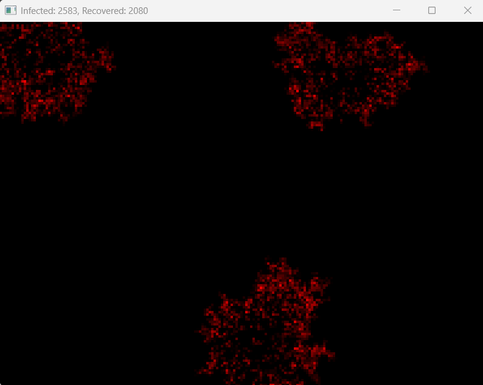

# 🦠 Infection Spread Heatmap Simulation

This project simulates the spread of an infectious disease using a proximity-based SIR model and visualizes it as a heatmap. Instead of tracking individual people or graph connections, the simulation focuses on infection **density** over time from a **top-down aerial view**, similar to how outbreaks are mapped in real-world epidemiology.

## 🌍 Concept

- Uniformly distributed agents across a 2D map.
- Slight Brownian motion to simulate interaction.
- Proximity-based infection: agents infect others within 5 meters.
- Infection probability decreases exponentially with distance.
- Agents recover after a random time.
- Recovered agents can be reinfected, but with lower probability.
- Heatmap shows infection **density**, not people.

## 🔧 Features

- ✅ Brownian motion (minimal movement)
- ✅ SIR model: Susceptible → Infected → Recovered
- ✅ Reinfection support
- ✅ Per-pixel infection heatmap (OpenGL GPU-accelerated)
- ✅ Custom-sized pixel grid (e.g., 200×150) rendered full-screen
- ✅ Real-time rendering using PyOpenGL + GLFW
- ✅ Scalable and optimized with spatial hashing
- ✅ Configurable menu for parameters (planned)

## 🖥️ Screenshot

```

```

## ⚙️ Menu Options

A configuration menu allows customization of:
- Number of agents
- Initial infected count
- Infection probability
- Infection radius
- Reinfection probability
- Tick speed (FPS)
- Pixel size (for rendering)

## 🚀 Running the Simulation

The window will show a red heatmap, where:
- Light red = low infection density
- Bright red = high infection density

No individual agents are shown — only the infection spread as a visual.

## 🧠 Model Summary

| Parameter              | Value / Range             |
|------------------------|---------------------------|
| Infection Radius       | 5 meters                  |
| Base Infection Prob.   | 0.8                       |
| Distance Decay         | Exponential ($e^{-kd}$)   |
| Recovery Time          | 400–800 ticks             |
| Reinfection Modifier   | 0.2 (i.e., 20% chance)    |
| Agents                 | 500+ (adjustable)         |

## 📌 License

MIT License

---

This simulation was built for educational and academic use to model how infections spread in a proximity-based population using GPU-accelerated heatmap rendering.
